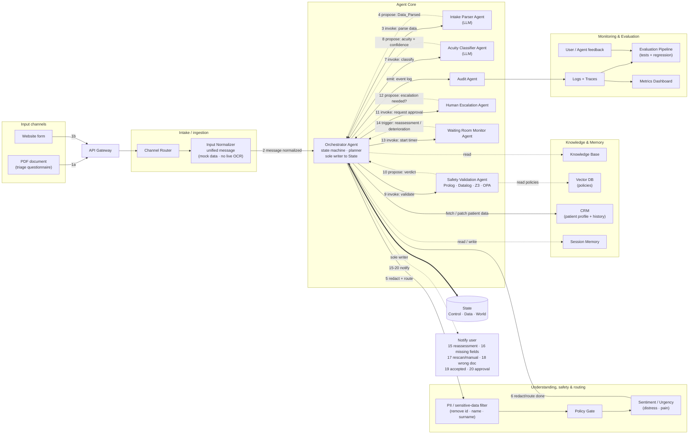
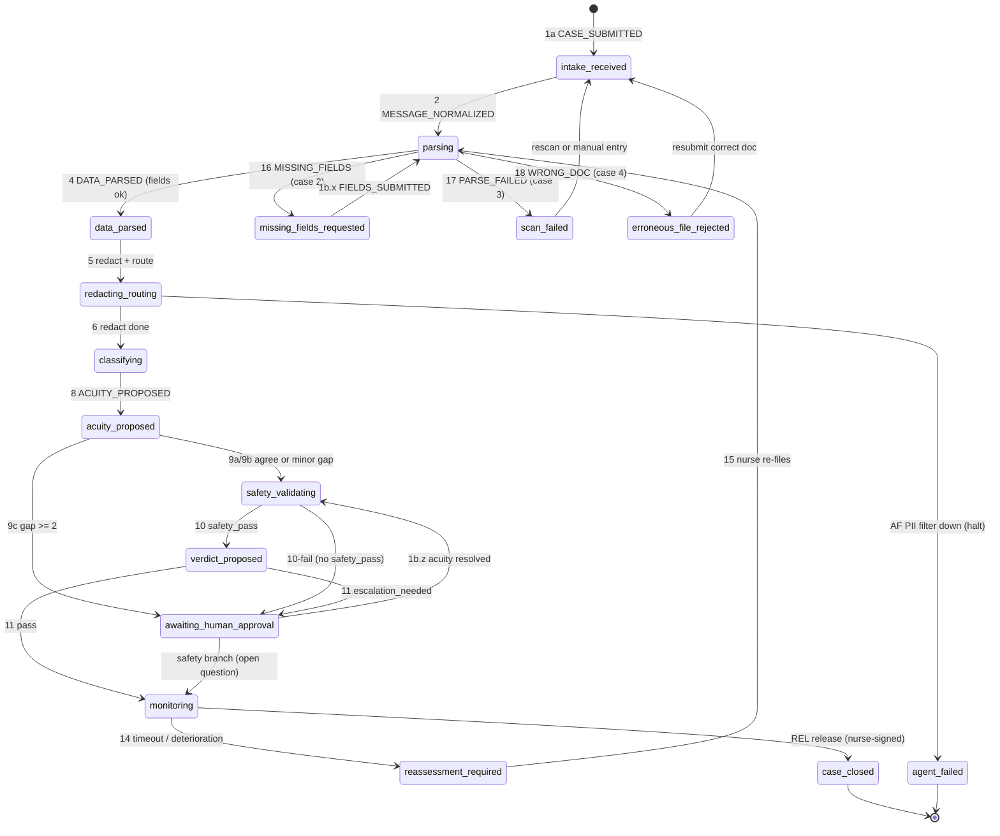

# Triage Guard Diagrams

_This is a companion to `triage-guard-spec.md`. It shows two views of the same system: the architecture, using a Mermaid version of the Whimsical board, and the central control-plane state machine._

---

## Architecture diagram

_The diagram uses the same groups, agents, and numbered arrows as the Whimsical board. **Solid** arrows show Orchestrator to agent actions. **Dashed** arrows show agent to Orchestrator proposals. The **thick** arrow is the only time the Orchestrator writes to State. The numbers match the arrow numbers in the Transitions table of the spec._

## State-machine diagram

The central control-plane state machine is built from the specification's Transitions table. All the details, such as guards, actions, world effects, and every agent-failure edge, remain in that table. This diagram shows the full control-plane flow from start to finish.

