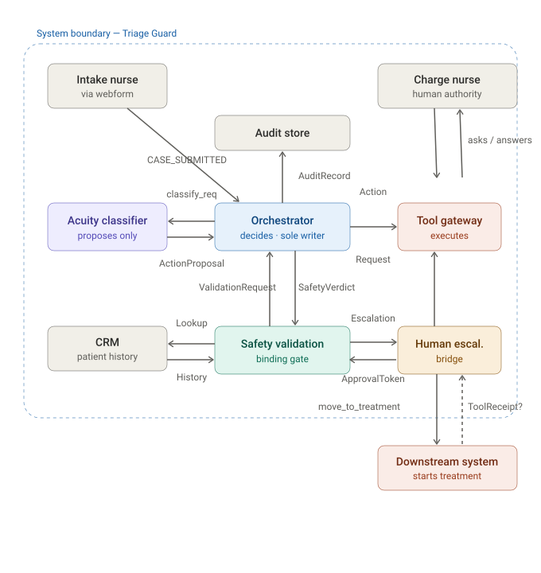
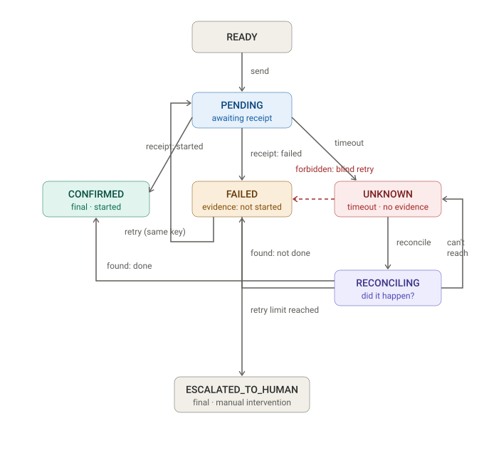

# Triage Guard - System Model

Triage Guard is an AI-assisted emergency-department triage system. This document models the parts of it that carry the most risk - not the whole system, but the seams where a set of individually-correct components can still fail as a whole: the gap between deciding on an action and executing it, the human-approval gate, and the approval queue under load. For those parts it sets out the outcome the system commits to, the separation of decision, execution, and human authority, the state and failure model for the one irreversible action, and the capacity and monitoring design that keeps it safe.

## Contents

- [1. System Definition](#1-system-definition)
- [2. The Safety-Fail Branch of the Human-Approval Gate](#2-the-safety-fail-branch-of-the-human-approval-gate)
- [3. Context & Components](#3-context--components)
- [4. Execution State Machine](#4-execution-state-machine)
- [5. Interface Contract & Failure Handling](#5-interface-contract--failure-handling)
- [6. Latency, Capacity & the Reversibility Split](#6-latency-capacity--the-reversibility-split)
- [7. Monitoring & Consistency](#7-monitoring--consistency)
- [8. Design Rationale](#8-design-rationale)

---

## 1. System Definition

_This section defines the system: the outcome it commits to, who may decide and execute,
what must never be sacrificed, what happens on component failure, and what is assumed
versus genuinely unknown._

### Business Outcome

Zero queue-order violations - no case where a less-acute patient is treated ahead of a
more-acute one - measured across 100% of cases.

This serves the broader clinical goal of preventing patient deterioration during the
wait. The system cannot control the clinical outcome directly; that depends on biology,
staffing, and bed availability, all outside its boundary. So it commits to the
controllable proxy: never let a critical patient be displaced in the queue. A patient
deteriorates in the queue after waiting too long, and waits too long when someone
less acute is treated first, so a queue-order violation is the controllable cause of the
deterioration the system exists to prevent.

### System of Interest

Triage Guard accompanies a case from submission of the structured intake form through to
release, and is responsible for acuity classification, queue ordering, safety
validation, and human approval, including re-triage.

Outside the boundary: the CRM (source of patient history, not always available), the
Tool Gateway and the downstream system that actually starts treatment, and the treating
clinical staff. The exit is asymmetric: **release** is a final, clean exit, while
**treatment started** is not necessarily final - a case can return from treatment to
re-triage if the patient's condition changes, so the system keeps accompanying the case
through to release.

### Authorities

- **Decision authority - the Orchestrator.** It is the sole writer to State. Agents,
  including the Acuity Classifier, only propose; they never decide or write. The
  classifier emits a proposed acuity and a confidence; the Orchestrator passes that
  proposal through the safety layers and is the only component that writes it to state.
- **Execution authority - the Tool Gateway.** It is the single execution point against
  the outside world for the irreversible treatment-move. The Orchestrator authorizes the
  move; the Gateway executes it. This split between the decider and the executor is what
  creates the UNKNOWN risk modeled later: the component that decides never gets certainty
  from the component that executes.
- **Human authority - the charge nurse or shift lead**, reached through the Human
  Escalation bridge. Required for acuity discrepancies (a gap of two or more between the
  nurse's and the system's acuity) and for safety-validation failures. The bridge conveys
  the question and returns the human's decision but holds no authority itself; the
  authority rests with the authorized person behind it. Human authority is _not_ required
  when the nurse and system agree, or for an ordinary release, so the human is a gate for
  contested and unsafe cases only, not a bottleneck on every case.

The LLM never has a direct arrow to an irreversible action. The path is: classifier
proposes → Orchestrator → safety validation and approval → Tool Gateway executes. Three
steps sit between the proposal and the irreversible act.

### Hard Constraints

Three lines that are never crossed, even to gain speed or accuracy. Each is a rule the
system is most tempted to break under load, which is when it matters most.

- **No unsafe treatment.** No case reaches treatment unless it has passed safety
  validation and holds any required approval. Never bypassed for load or speed - a
  treatment started on an unvalidated case can be fatal.
- **Full auditability.** Every state-changing action is written to an append-only audit
  log. Never sampled or deferred for performance - an unlogged or unexplainable decision
  is indefensible clinically and legally.
- **Acuity-ordered fairness.** An emergent patient is never ordered behind a less-acute
  one. Never traded for throughput - a displaced critical patient deteriorates in the
  queue. (This is the Business Outcome, restated as an inviolable rule.)

### Safe Fallbacks

Two defined safe behaviors for a component outage, each falling toward the safe
direction, and neither breaking a Hard Constraint. The direction follows from what breaks
if we continue: the classifier guards accuracy (compromisable for a while), the validator
guards safety (not compromisable - it needs a human substitute).

- **Acuity Classifier unavailable - fail-open, degrade.** Drop the system acuity and fall
  back to the nurse's proposed acuity, which is always present from intake. Disable the
  discrepancy gate for the outage, since there is nothing to compare against. Flag these
  cases for later review and alert the technician. Safe because acuity authority already
  rests with the nurse, and the flag preserves auditability. All three Hard Constraints
  still hold.
- **Safety Validation unavailable - degrade-to-human.** Do not halt the line. Route every
  case to the charge nurse for manual safety approval, and alert the technician. The
  safety-and-approval guarantee holds by substituting a human validator for the automated
  one; routing _all_ cases, not just suspicious ones, is the safe choice, because without
  the validator the system cannot tell safe from unsafe. Cost: the human approval queue
  spikes - quantified in the capacity model.

### Assumptions

- **The nurse always supplies a correct proposed acuity at intake.** If this is wrong,
  the classifier-down fallback rests entirely on the nurse's acuity, and a mis-triage
  propagates unchecked, because the cross-check is the thing disabled during that outage.
- **When the Tool Gateway returns a "done" receipt, treatment actually started.** If this
  is wrong, the system believes a patient is in treatment when they are not, and the
  patient silently drops out of both the queue and active care.

Both assumptions share a shape: even when the system is "working," it trusts an actor
outside its own boundary - the nurse, the Gateway. That is what makes them assumptions
rather than facts.

### Unknowns

We mark these explicitly rather than invent a value. An explicit unknown is honest; a
made-up number looks like a fact until it fails in production.

- **Per-agent retry budgets are undefined in the spec.** We do not invent a number. What
  we do fix is that a retry budget exists, that it must be finite (an irreversible action
  cannot be retried indefinitely), and that it differs per agent. The value depends on
  data we do not yet have - real Gateway response times, real timeout rates,
  reconciliation duration - so it has to be decided from data, not feel. This controls the
  treatment-move UNKNOWN problem modeled next.
- **The safety-fail branch of the human-approval gate is undefined.** The gate is entered
  for two different reasons: an acuity discrepancy (resolved - the nurse chooses the
  system's or the nurse's acuity) and a safety-validation failure (unresolved). For the
  safety-fail reason, the nurse's options, where each option sends the case, and whether
  it requires charge role are all undefined, so a case can currently reach the gate on a
  safety-fail and hit a dead end. This is the highest-value gap to close before code,
  because it is a known hole, not a hypothetical one.

---

### What the system definition establishes

- The exit boundary is asymmetric: release is final, treatment is not (re-triage can
  follow), so the system must keep watching a case after treatment starts.
- The decision/execution split (Orchestrator authorizes, Gateway executes) is the origin
  of the UNKNOWN risk modeled next.
- Two live assumptions rest on actors outside the boundary: nurse acuity, and a "done"
  receipt meaning treatment truly started.
- Two genuine unknowns are flagged rather than guessed (retry budget; the safety-fail
  branch), and both feed directly into the next modeling steps.

---

---

## 2. The Safety-Fail Branch of the Human-Approval Gate

_A case can enter the approval gate for two different reasons. The acuity-discrepancy
reason is specified elsewhere; the safety-fail reason is resolved here. The resolution
holds to two constraints: never bypass safety or approval, and never silently return the
same case to the queue without changing `acuity`, `clinical_status`, or `safety_verdict`._

### The core distinction: correction versus override

When safety validation returns "fail," it has given the system **information** - a
specific signal that this case is dangerous. So the nurse's role at the gate is to
**correct**, not to **approve a bypass**. The system has no "ignore safety" path at all.
This one decision shapes everything below: a safety failure becomes a _request to fix_,
never a _request for permission to skip_.

### Resolution

1. **No override exists.** There is no route that skips safety. The gate never offers an
   "override and proceed" action.

2. **Correction (charge role required).** The charge nurse corrects the data in the
   webform. A safety-fail is a high-risk exception, so it requires `actor_is_charge`,
   consistent with the discrepancy branch. The system **enforces that at least one of**
   `acuity`, `clinical_status`, or `safety_verdict` **actually changed**; if nothing
   changed, the submission is rejected as "correction required." This satisfies the spec's
   second constraint and prevents an infinite fail → gate → same-input → fail loop.

3. **Revalidate.** Safety validation runs **again** on the corrected version, via the
   reassessment path. If it passes, the case proceeds normally. If it fails again, it
   returns to the gate.

4. **Loop guard.** There is a maximum number of correction rounds. When exhausted, the
   case **escalates to a more senior clinician on shift** (for example the attending
   physician) rather than looping forever. The exact maximum is another value we do not
   invent here; it is fixed from data, like the machine retry budget. What is fixed now is
   that a finite bound and an escalation target exist.

5. **Queue position while waiting.** The case leaves the **normal queue order** - it does
   not compete for a bed on a disputed acuity - but it does **not disappear**. It sits in
   the approval gate, visible and monitored, with its own service-level target for how
   long it may wait for correction before that wait itself becomes an alert. The Waiting
   Room Monitor watches it. This holds acuity-ordered fairness (it cannot displace a valid
   patient) without creating the opposite hazard (a possibly-critical patient forgotten
   off to the side).

### Why "validation failed" and "validator down" are opposite cases

These look similar - both send a case to a human - but they are inverses, and treating
them the same would be dangerous:

- **Validation returned "fail"** - the validator _worked_ and produced a specific danger
  signal. Resolution: correct-and-revalidate (above). No override, because there is a
  concrete reason to distrust this case.
- **Validator is down** - the validator produced _no information_; the system is blind,
  not warned. Resolution: the separate safe fallback (route every case to the charge nurse
  for manual approval). Here the human _provides_ the safety judgment the dead machine
  could not.

Neither case is an override. In the first, a human corrects and the machine re-checks. In
the second, a human performs the check in place of the machine. In both, safety is
_evaluated_, never _skipped_. That is why the system builds no override mechanism at all:
the moment an "ignore safety" button exists, it could also be used in the first case,
where the validator flagged real danger - the forbidden move. "Override" and
"human-provided validation" look alike but are opposites: one skips a check, the other
performs it. A safe system permits the second and forbids the first, so it never builds
the button.

### Consequences of this design

- The architecture should contain **no safety-override path at all** - a conclusion that
  was not obvious from the business request and became clear only by modeling the two
  entry reasons of the same gate side by side.
- A **third undefined budget** appears (the human correction-round limit), parallel to the
  machine retry budget. Both are finite, both escalate on exhaustion, both are fixed from
  data rather than guessed.
- The gate needs its own **waiting service-level target**, because a case parked for
  correction is out of the acuity queue and could otherwise be forgotten.

---

## 3. Context & Components

_This section draws what is inside the system boundary and what is external, and gives
every arrow a semantic name, so the authority separation is visible and checkable. There
is no direct arrow from the LLM to an irreversible action, by design._

### Context diagram



### Entities

**Inside the boundary**

- **Orchestrator** - decision authority; the sole writer to state.
- **Acuity Classifier** - the LLM; proposes only.
- **Safety Validation** - the binding safety gate.
- **Human Escalation bridge** - the conduit to the human authority.
- **Tool Gateway** - execution authority; the single execution point for the
  irreversible treatment-move.
- **Audit Store** - the append-only record of every state change.

**Outside the boundary**

- **Intake nurse (via webform)** - human actor; supplies the case and the proposed acuity.
- **Charge nurse** - human authority; resolves discrepancies and safety failures.
- **CRM** - source of patient history; not always available.
- **Downstream treatment system** - what the Gateway actually drives to start treatment.

_Not shown: the Waiting Room Monitor exists in the system (it watches cases parked for
correction, per the safety-fail resolution), but it is omitted from this reduced context
diagram, which shows only the decision-and-execution path. Its omission here is
deliberate, not an inconsistency._

### Arrows (semantics)

| From → To                        | Message                                                                                                             | Meaning                                                                                  |
| -------------------------------- | ------------------------------------------------------------------------------------------------------------------- | ---------------------------------------------------------------------------------------- |
| Intake nurse → Orchestrator      | `CASE_SUBMITTED { complaint, vitals, nurse_proposed_acuity }`                                                       | A new case enters; carries the nurse's proposed acuity among other fields.               |
| Orchestrator → Acuity Classifier | `classify_request { case_payload }`                                                                                 | Ask for an acuity proposal. Payload carries **no identifiers**.                          |
| Acuity Classifier → Orchestrator | `ActionProposal { proposed_acuity, confidence }`                                                                    | A proposal, not a fact - the Orchestrator decides what to do with it.                    |
| Orchestrator → Safety Validation | `ValidationRequest { case_payload, proposed_acuity }`                                                               | Check the proposal against the case before any write.                                    |
| Safety Validation → Orchestrator | `SafetyVerdict { pass \| fail, reason }`                                                                            | A binding verdict; `reason` drives the correction path on `fail`.                        |
| Orchestrator → CRM               | `HistoryLookup { patient_id }`                                                                                      | The only arrow that carries the identifier.                                              |
| CRM → Orchestrator               | `PatientHistory { prior_visits, conditions }`                                                                       | History merged into the current case.                                                    |
| Orchestrator → Human Escalation  | `EscalationRequest { case, reason: discrepancy \| safety_fail }`                                                    | Reason determines which question the human gets.                                         |
| Human Escalation → Orchestrator  | `ApprovalToken { decision, actor_is_charge, approval_id, expires_at }`                                              | An authenticated, time-bounded decision - must be re-checked as valid at execution time. |
| Orchestrator → Tool Gateway      | `ActionRequest { move_to_treatment, request_id, action_hash, idempotency_key, issued_at, approval_id, expires_at }` | The irreversible act - sent only after `safety_passed ∧ approved`.                       |
| Tool Gateway → Downstream        | `move_to_treatment { case_id, idempotency_key }`                                                                    | The execution against the outside world.                                                 |
| Downstream → Tool Gateway        | `ToolReceipt { started \| failed }` - **or nothing (timeout)**                                                      | Three outcomes, not two - the missing receipt is the UNKNOWN.                            |
| Orchestrator → Audit Store       | `AuditRecord { action, actor, timestamp, before → after, reason }`                                                  | Every state change is recorded - the auditability constraint.                            |

### Authority separation - why the arrows are shaped this way

The diagram separates three authorities so that no single component can both decide and
act. The Acuity Classifier only emits an `ActionProposal`; it never writes state and has
no path to execution. The Orchestrator is the sole decider and the sole writer to state:
every proposal, verdict, and approval converges on it, and only it authorizes action. The
Tool Gateway is the single execution point for the irreversible treatment-move, reached
only after `SafetyVerdict = pass` and, where required, an `ApprovalToken` from the charge
nurse. So there is no arrow from the classifier, or any agent, to the Gateway: routing an
irreversible act straight from a probabilistic proposer would let an unvalidated,
unapproved decision reach the real world. The `ToolReceipt` arrow is dashed because it may
never arrive - the origin of the UNKNOWN problem modeled next.

### Two boundary facts the diagram makes checkable

- **The identifier stops at the CRM lookup.** `patient_id` travels only on the
  Orchestrator ↔ CRM arrows. Every arrow into the classifier and the safety validator
  carries `case_payload` with no identifiers. If any arrow forwarded `patient_id` toward
  the model, that would be a visible violation of the privacy boundary.
- **Two different kinds of return arrow.** `SafetyVerdict` is a binding verdict (the
  Orchestrator must respect it); `ApprovalToken` is a time-bounded token (the Orchestrator
  must re-verify it is still valid at execution time). Naming them differently keeps the
  distinction visible: a proposal is weighed, a verdict is obeyed, a token is verified.

---

## 4. Execution State Machine

_This section models the **treatment-move execution**, the only irreversible
side effect in the system. The aim is to make the UNKNOWN explicit. A timeout is not a
failure, and treating it as one would let a blind retry start treatment twice. The
machine below keeps "we know it failed" and "we don't know" as separate states, so a
retry can happen only once we have evidence the move did not occur._

### State machine



### States

| State                | Meaning                                                                                    | Final?  |
| -------------------- | ------------------------------------------------------------------------------------------ | ------- |
| `READY`              | `ActionRequest` built, not yet sent.                                                       | no      |
| `PENDING`            | Sent to the Tool Gateway, awaiting a receipt.                                              | no      |
| `CONFIRMED`          | Receipt "started" received - treatment began.                                              | **yes** |
| `FAILED`             | Receipt "failed" received - we have evidence the move did **not** happen; safe to retry.   | no      |
| `UNKNOWN`            | Timeout, no receipt - we do **not** know whether the move happened. Never retried blindly. | no      |
| `RECONCILING`        | Querying the source of truth to establish whether the move actually happened.              | no      |
| `ESCALATED_TO_HUMAN` | Retry budget exhausted - a human must intervene manually.                                  | **yes** |

Two things make this machine safe, rather than a naive success/fail pair:

- **`FAILED` and `UNKNOWN` are distinct.** `FAILED` means positive evidence the action did
  not occur (a "failed" log). `UNKNOWN` is the _absence_ of evidence (a timeout). The move
  may or may not have happened. That difference is what the model exists to capture.
- **There are two final states, and every path reaches one.** A case ends in `CONFIRMED`
  (success) or `ESCALATED_TO_HUMAN` (automatic attempts exhausted). No case can silently
  get stuck in a non-final state with nobody aware of it.

### Event catalog

Each event names the authoritative producer - the component allowed to cause the
transition - and, where relevant, the source of evidence it relies on.

| Event                  | Transition                       | Producer     | Evidence source                     |
| ---------------------- | -------------------------------- | ------------ | ----------------------------------- |
| `send_request`         | READY → PENDING                  | Orchestrator | -                                   |
| `receipt_started`      | PENDING → CONFIRMED              | Tool Gateway | downstream system                   |
| `receipt_failed`       | PENDING → FAILED                 | Tool Gateway | downstream system                   |
| `timeout`              | PENDING → UNKNOWN                | Orchestrator | its own timer                       |
| `reconcile_result`     | RECONCILING → CONFIRMED / FAILED | Orchestrator | Audit Store (+ downstream re-query) |
| `retry`                | FAILED → PENDING                 | Orchestrator | its own retry counter               |
| `retry_limit_reached`  | FAILED → ESCALATED_TO_HUMAN      | Orchestrator | its own retry counter               |
| `reconcile_unresolved` | RECONCILING → UNKNOWN            | Orchestrator | - (source unreachable)              |

**Producer versus evidence source.** The producer is the component allowed to _cause_ the
transition, not whichever component supplied a fact along the way. For `reconcile_result`
the Audit Store answers the question "did the move happen?", but the Orchestrator is the
producer: it starts the reconciliation, reads the source, decides what the answer means,
and writes the new state. The Audit Store is the evidence source, the way the classifier
is the evidence source for an acuity decision - it informs, it does not decide.

**Why almost every event is produced by the Orchestrator.** Only events that originate in
the outside world - `receipt_started`, `receipt_failed` - belong to the Tool Gateway.
Every other event is a decision or a measurement derived from state the Orchestrator alone
holds: the timer for `timeout`, the retry counter for `retry` and `retry_limit_reached`,
the reconciliation outcome for `reconcile_result`. That is a consequence of the
Orchestrator owning the state (below): any event derived from state is its to produce.

### State owner

The critical state variable `execution_state` has a single owner: the **Orchestrator**.
Most transitions are derived from state the Orchestrator holds, so the owner has to be
single. If two components could write `execution_state`, they would race - the Gateway
writing `CONFIRMED` at the same moment the Orchestrator writes `timeout → UNKNOWN`. A
single owner rules that out: the Gateway reports facts (receipts), and the Orchestrator
alone turns facts and timers into state.

### Forbidden transition

**`UNKNOWN → PENDING` directly (a blind retry).** From `UNKNOWN` the machine must pass
through `RECONCILING` first; only after reconciliation returns "not done" (reaching
`FAILED`) may a retry send a fresh `ActionRequest`.

**Hazard.** If the original move actually happened but the receipt was lost, a direct
retry would start treatment a **second** time on the same patient. Reconciliation
establishes the real state before any further attempt. The `idempotency_key` is carried
unchanged across retries as a second line of defense: even if a retry does go out, the
Gateway can recognize it as the same action and refuse to start treatment twice.

### Design notes

- Reconciliation does not create a new outcome - it _resolves_ `UNKNOWN` into one of the
  states we already have (`CONFIRMED` or `FAILED`). Its job is to turn "don't know" into
  "know".
- Retrying the _reconciliation_ is safe (a query changes nothing in the world); retrying
  the _action_ is dangerous and strictly bounded. The machine separates the two, which is
  why `RECONCILING → UNKNOWN` (re-query) is allowed but `UNKNOWN → PENDING` (re-act) is
  forbidden.
- A third budget appears here too - the machine retry limit - matching the human
  correction-round limit from the safety-fail resolution. Both are finite, and both
  escalate on exhaustion.

---

## 5. Interface Contract & Failure Handling

_This section defines what may cross the interface for the irreversible treatment-move,
and what the system does when it cannot tell whether the move happened. The contract and
the failure model both build on the execution state machine above._

### The ActionRequest contract

```
ActionRequest {
  request_id        // unique id for this request
  case_id           // which case
  action_type       // move_to_treatment
  action_hash       // hash of the action content - proves it was not altered
  idempotency_key   // prevents a duplicate execution
  issued_at         // when it was created
  approval_id       // link to the human approval, where one is required
  expires_at        // until when the approval / request is valid
}
```

### Three levels of check

The three checks answer three different questions, and each has to run at a different
moment. The distinction is the point: schema and semantic checks run once, at build time;
runtime checks re-verify, at the last moment, things that can change between decision and
execution.

| Level        | Checks     | Example                                                                                                          | When                       |
| ------------ | ---------- | ---------------------------------------------------------------------------------------------------------------- | -------------------------- |
| **Schema**   | Shape      | All fields present; `action_type` is a valid value; `idempotency_key` is a well-formed string.                   | On receiving the request   |
| **Semantic** | Meaning    | `case_id` points to a case that exists and passed safety; `approval_id` points to a real approval.               | When building the request  |
| **Runtime**  | Still-true | `now < expires_at`; `action_hash` matches; the approval is bound to this case and came from a charge-role actor. | At the moment of execution |

The three runtime checks all guard against the same thing - the world moving between
preparation and execution:

- **Validity still holds (`expires_at`).** An approval is checked as valid when it
  arrives, but time passes before the Orchestrator sends the action - the case may have
  waited in the queue, or gone through reconciliation. If `expires_at` has passed, the
  approval is stale and the action is no longer backed by a live approval. So the check is
  `now < expires_at`, verified in the moment before sending.
- **The action did not change (`action_hash`).** The hash is a fingerprint of exactly
  what was approved. The human approved "move case X, acuity 2, to treatment." If anything
  altered the action between approval and execution - a bug, a race, a malicious input -
  the hash will not match and execution stops. This blocks an approval being reused for a
  different action, and can only be checked once the final action is known.
- **The approval is bound and authorized (`approval_id`).** Not enough that an
  `approval_id` exists: it must belong to _this_ case (not lifted from another), and it
  must come from an authorized signer (`actor_is_charge`). This blocks two attacks - an
  approval stolen from another case, and an approval from someone not permitted to give
  one.

This is what the `ApprovalToken` naming in the context model was pointing at: a token whose validity
has to be re-verified at execution time, not a plain yes/no.

### Failure scenario - Tool Gateway timeout

The Gateway sends `move_to_treatment` to the downstream system; X seconds pass with no
receipt.

- **Next state: `UNKNOWN`** - not `FAILED`. A timeout is the absence of evidence, not
  evidence of failure.
- **Forbidden: a direct retry from `UNKNOWN`.** The move may already have happened, and
  retrying blindly would start treatment twice.
- **Correct next step:** transition to `RECONCILING` and query the source of truth (Audit
  Store, downstream re-query). Reconciliation resolves `UNKNOWN` into `CONFIRMED` (it
  happened - do nothing) or `FAILED` (it did not - now safe to retry, same
  `idempotency_key`).
- **If reconciliation itself cannot resolve** (source unreachable), stay in `UNKNOWN` and
  re-query with backoff, up to the retry budget; on exhaustion, escalate to
  `ESCALATED_TO_HUMAN`.

### Safe retry, reconciliation, idempotency

- **Safe retry rule.** A retry of the action is allowed only from `FAILED`, where there is
  evidence the move did not occur - never from `UNKNOWN`. Every retry carries the **same**
  `idempotency_key`. The retry count is bounded; on exhaustion the case escalates to a
  human.
- **Reconciliation.** From `UNKNOWN`, before any further attempt, the Orchestrator asks the
  source of truth whether the move happened. The answer maps to `CONFIRMED` (happened -
  leave it) or `FAILED` (did not - safe to try). A reconciliation is a query and changes
  nothing in the world, so it is safe to repeat.
- **Idempotency.** The `idempotency_key` is the last line of defense: even if a retry does
  go out against an action that already happened, the Gateway recognizes the repeated key
  and refuses to start treatment twice. This protects execution at the interface, on top
  of the state machine protecting the decision.

### Evidence to retain

To reconstruct what happened after the fact, evidence has to cover every critical
transition, not just the start and end. A hard case runs send → timeout → reconcile →
retry → confirm, and each junction needs its own record.

| Evidence                                                                          | Proves                                | Critical for                      |
| --------------------------------------------------------------------------------- | ------------------------------------- | --------------------------------- |
| `request_id`, `idempotency_key`, `issued_at`                                      | what was sent, and when               | identifying a duplicate execution |
| `tool_receipt` **or** `timeout@T` (no receipt)                                    | what came back, or that nothing did   | why the case entered `UNKNOWN`    |
| `reconcile_record { queried_at, source, result: done \| not_done \| unresolved }` | what reconciliation found             | justifying the retry              |
| `approval_id`, `actor_is_charge`, `expires_at`                                    | who approved, and under what validity | legal defense / no-bypass         |

The one that is easy to miss is `reconcile_record`. Without it, the trail shows "timeout,
then retry, then success" but cannot show that a check confirmed the retry was safe. If a
double-treatment ever occurs, that record is what shows whether reconciliation was wrong
or was skipped - the difference between a responsible retry and a blind one.

### Guiding principle

UNKNOWN is not FAILED. For an action with a real-world side effect, a blind retry can
perform the same action twice, so the system checks the authoritative state - through
reconciliation - before any further attempt.

---

## 6. Latency, Capacity & the Reversibility Split

_This section checks whether the architecture can meet its timing and load targets, using
representative nominal service times and load figures. The target: initial containment at
P95 within 8 seconds._

### Nominal service times

| Stage                          | Time  |
| ------------------------------ | ----- |
| Ingestion                      | 0.4s  |
| Retrieval                      | 0.7s  |
| Classification                 | 0.3s  |
| LLM                            | 1.5s  |
| Policy                         | 0.2s  |
| Tool Gateway                   | 0.2s  |
| External Tool                  | 1.1s  |
| Human Approval (when required) | +4.0s |

### Latency budget

- **Nominal path without human approval:** 0.4 + 0.7 + 0.3 + 1.5 + 0.2 + 0.2 + 1.1 =
  **4.4s**. Under the 8s target - but this is the nominal sum, not a P95.
- **Nominal path with human approval:** 4.4 + 4.0 = **8.4s**. Already over the 8s target
  at nominal, before any load or tail effects.

**Does the budget alone prove P95 ≤ 8s? No.** The nominal sum is the time when every stage
runs at its typical speed - roughly the median, not the tail. P95 is the 95th percentile:
sort every case from fast to slow, drop the slowest 5%, and read the time at position 95.
Each stage has its own distribution, and in a series the tails accumulate - one slow stage
is enough to make the whole path slow, and with several stages the chance that at least
one is slow on a given request rises. So the P95 of the total sits well above the nominal
sum. A nominal figure can rule compliance _out_ (the with-approval path at 8.4s already
fails) but cannot prove it _in_; that needs measured percentiles.

Human approval is the largest and most variable term (4.0s of the 8.4s), and the only one
that does not scale with compute - a free nurse answers in seconds, a busy one in tens of
seconds. It is the fattest tail in the budget, so it is the thing that most needs
measuring, not the thing that cannot be measured.

### Capacity - the human approval queue

A queue is governed by two rates: the arrival rate (λ) and the service rate (μ). If
arrivals outpace service, the queue grows without bound.

- **Arrival rate (λ):** 0.6 approval-requiring cases per second.
- **Approvers:** 2. **Mean approval time:** 4s.
- **Per-approver service rate:** 1 / 4 = 0.25 approvals per second.
- **Total service rate (μ):** 2 × 0.25 = **0.5 approvals per second.**

**Utilization:** ρ = λ / μ = 0.6 / 0.5 = **1.2**.

ρ ≥ 1 means the queue is unstable. At ρ = 1.2, arrivals exceed service by 0.1 per second:
about 6 cases pile up per minute, 360 per hour, growing indefinitely. The human approval
layer cannot hold this load.

### Would adding LLM workers fix it? No.

The slowest compute stage is the LLM at 1.5s, so the instinct is to add LLM workers. That
does nothing here. The bottleneck is human approval, not compute. Add a hundred LLM
workers and requests still stall in the human queue, because two nurses cannot approve
more than 0.5 per second - the faster pipeline only feeds the human bottleneck sooner.
It is like widening the road that leads to a jam: you reach the jam faster.

Only two things lower ρ below 1:

- **Raise μ** - more approvers, or faster approvals. Three approvers gives μ = 0.75 and
  ρ = 0.8. But human approvers are a scarce, expensive resource; a third nurse cannot be
  added like a server, and under real ED load may not be free at all.
- **Lower λ** - send fewer cases to the human gate in the first place. This is the
  architectural lever, and it connects back to the failure model: when Safety Validation
  is down, _every_ case is routed to a human, which is exactly what floods the queue. In
  normal operation only genuinely contested cases (discrepancy or safety-fail) need a
  human; keeping the gate strict about what it escalates keeps λ down.

### Architecture decision - separate reversible containment from the irreversible act

The costly, unscalable step is any action that needs a human. So split actions by
reversibility:

| Type                         | Actions                                 | Handling                                                  |
| ---------------------------- | --------------------------------------- | --------------------------------------------------------- |
| **Reversible (containment)** | Queue placement / re-ordering by acuity | Automatic, fast, no human                                 |
| **Irreversible**             | Move to treatment · patient release     | Under safety validation + human approval, never automatic |

**Reversible containment: queue position.** The moment the system suspects a patient is
high-acuity, it moves them up the queue automatically, protecting them from a dangerous
wait without waiting for approval. This is real containment - the risk (deterioration
while waiting) is neutralized at once - and it is fully reversible: if it turns out to be
a false alarm, the patient is simply moved back. No human, milliseconds, no irreversible
effect.

**Irreversible actions stay under a human.** Two actions are irreversible, in opposite
directions:

- **Move to treatment** - irreversible as an action on the world: once real treatment
  begins, it cannot be undone. Risk: starting treatment on an unsafe case.
- **Patient release** - irreversible as an exit from the system: once released, the
  patient is no longer queued or monitored, so a wrong release means we have lost the
  ability to keep watching. Risk: stopping monitoring too early.

Both stay under safety validation and human approval, and never run automatically.

**Why this meets the target.** Separating the two lowers λ at the human gate. The bulk of
activity - continuous queue management - never touches a human, so it does not enter the
0.5-per-second bottleneck. Only the irreversible moves need approval, and they happen less
often and without time pressure on the patient, who is already protected by the automatic
containment. The system gets fast, reversible protection for everyone, and reserves the
scarce human capacity for the two actions that genuinely require it.

---

## 7. Monitoring & Consistency

_This section checks that all views tell the same story, then defines the runtime metrics.
Each metric is tied to a requirement or an assumption, with a threshold and a response._

### Consistency check - all pass

The five documents (Canvas, Context Diagram, State Machine, Contract, Capacity) were
cross-checked. Everything lines up:

- **Execution authority = Tool Gateway** - the same in the Canvas, the Diagram, the State
  Machine, and the Contract.
- **Sole writer / state owner = Orchestrator** - the same in the Canvas, the Diagram, and
  the State Machine, which names the single owner of `execution_state`.
- **Every event producer exists as a component.** The catalog's producers are the
  Orchestrator and the Tool Gateway, and both appear in the Diagram.
- **Timing fields are consistent.** `expires_at` and the retry budget appear the same way
  wherever they are relevant. The retry budget is consistently an undefined-but-finite
  value, not a guessed number - "not yet defined everywhere" is itself consistent.
- **The Waiting Room Monitor** is noted as intentionally omitted from the reduced context
  diagram, so no view contradicts another.

### Monitoring map

Two metrics, each guarding something fragile that earlier steps surfaced.

| #   | Metric                              | Guards                                                                                               | Threshold                                                              | Response                                                                                                                                              |
| --- | ----------------------------------- | ---------------------------------------------------------------------------------------------------- | ---------------------------------------------------------------------- | ----------------------------------------------------------------------------------------------------------------------------------------------------- |
| 1   | Stuck / spiking `UNKNOWN` cases     | The assumption that a receipt means real execution; the requirement that no case gets silently stuck | More than N cases in `UNKNOWN` beyond Y seconds (N, Y fixed from data) | The stuck case escalates to `ESCALATED_TO_HUMAN`; a spike pages the on-call technician for a Gateway/reconciliation outage                            |
| 2   | Human-approval utilization, ρ = λ/μ | The capacity requirement - the human approval queue must stay stable (ρ < 1)                         | ρ > 0.8                                                                | Lower λ first (verify reversible containment is carrying its share and only irreversible/contested cases reach the gate); then raise μ (page a nurse) |

#### Metric 1 - stuck or spiking UNKNOWN cases

A case entering `UNKNOWN` is normal and expected - a timeout happens occasionally, and
reconciliation exists to resolve it. So the metric does not alert on every entry, which
would fire constantly. What matters is a case that _stays_ in `UNKNOWN`, or a sudden
_spike_ of them:

- A case stuck in `UNKNOWN` past Y seconds means reconciliation cannot resolve it (source
  unreachable or hung).
- More than N cases in `UNKNOWN` at once means the Gateway or the downstream system has
  failed and every request is timing out.

The response works on two levels. The individual stuck case escalates to
`ESCALATED_TO_HUMAN`, as the state machine already defines. A spike is a system problem,
not a per-case one - no nurse can fix it - so it pages the on-call technician to repair
the infrastructure. This is the split between a clinical escalation (a nurse handles the
case) and an operational one (a technician fixes the component).

#### Metric 2 - human-approval utilization (ρ)

ρ = λ/μ is the one number that captures the queue's health: the ratio of the
approval-request arrival rate to the approver service rate, over a rolling window. It is a
leading indicator - it warns before patients are stuck waiting, rather than after.

The threshold is ρ > 0.8, not ρ ≥ 1.0. Waiting time does not grow linearly with ρ; it
grows with ρ/(1−ρ), which climbs steeply near 1: at ρ = 0.8 the factor is 4, at 0.9 it is
9, at 0.95 it is 19. By 1.0 the queue is already exploding and patients are already stuck.
0.8 is the point where there is still time to respond before the curve runs away.

The response is the reversibility split, now monitored. Lower λ first, because it is
cheap and immediate: reversible actions (automatic queue placement) bypass the human gate
entirely and must never be routed through it, so confirm that path is carrying its share
and that only genuinely irreversible or contested cases (move-to-treatment, release,
discrepancy, safety-fail) reach the gate. If reversible work is leaking into the human
queue, that is the λ to cut. Only if λ cannot be reduced further, raise μ by paging an
additional charge nurse - the scarce, expensive lever.

The reversibility split and this metric are the same mechanism seen twice: the split
defines the behavior (reversible runs automatically, irreversible stays under a human),
and this metric watches that the split holds in production (ρ stays low).

---

## 8. Design Rationale

### Model versus system

The Acuity Classifier answers a narrow question: given a case, what is the best acuity? It
takes a case and proposes an acuity with a confidence, and that is the whole of its
concern. The system around it answers a different set of questions: who is allowed to
decide and act, what must be true before an irreversible action happens, what happens when
a component is unavailable or returns nothing, and how every action is recorded so it can
be reconstructed afterward. The classifier is one component inside that system, and it
only proposes; the Orchestrator decides, safety validation gates, the Tool Gateway
executes, and the audit store records. The model optimizes for being _right_; the system
has to stay safe even when the model is wrong, unavailable, or uncertain. That is why
almost all of the design is about authorities, states, failure handling, and evidence, and
almost none of it about the classifier's accuracy.

### Why there is no safety-override path

An early, non-obvious question is what happens when safety validation fails and a human
has to intervene. The human-approval gate is entered for two different reasons - an acuity
discrepancy and a safety-validation failure - and the second needs its own resolution.
The design conclusion is that the system contains no safety-override path at all: a
safety failure is a request to _correct and revalidate_, never permission to skip the
check. The reason is that the moment an "ignore safety"
button exists, it can also be used on a case the validator genuinely flagged as dangerous

- so the safe design is to never build the button. A one-line request to "help triage
  patients safely" could never have implied that rule; the model is what exposed it.

### The assumption that would force a redesign

The load-bearing assumption is that a "done" receipt from the Tool Gateway means treatment
actually started. The whole reconciliation design trusts the sources it queries. If a receipt, or
the audit record behind it, can report "done" when nothing happened, then reconciliation
can resolve `UNKNOWN` to `CONFIRMED` for a case that never entered treatment - and the
patient silently drops out of both the queue and active care, with no alarm, because the
system believes they are being treated. If that assumption proves false, the model has to
change: reconciliation would need a second, independent source of truth to confirm a
"done", rather than trusting a single receipt.

### Closing note

The pattern holds across the whole design: the risky parts of Triage Guard are not in the
classifier. They are in the seams - the decision-to-execution gap that produces the
UNKNOWN, the human gate that two different failures feed into, and the human queue that
tips from stable to overwhelmed at ρ = 1. Modeling those seams before writing code turns
vague risks into concrete, checkable decisions.
