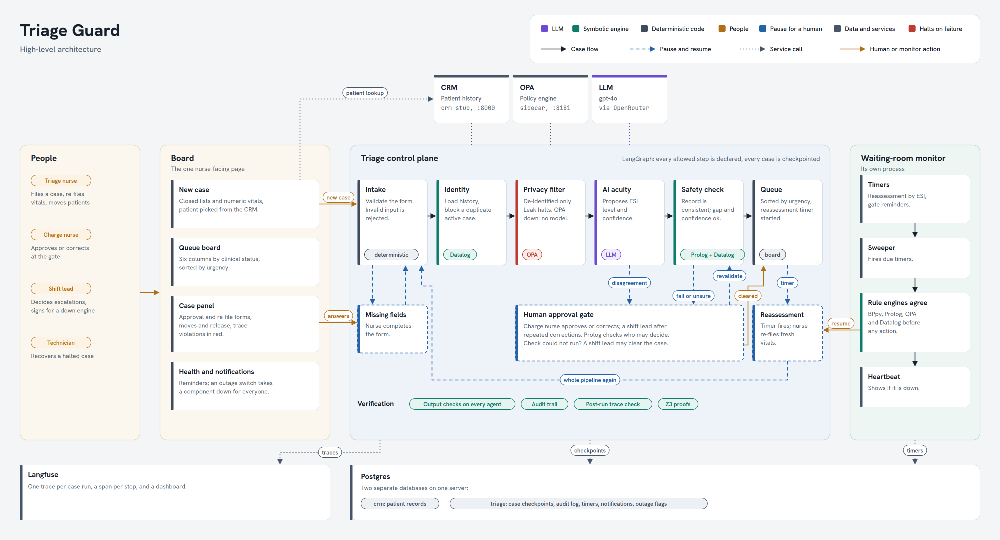
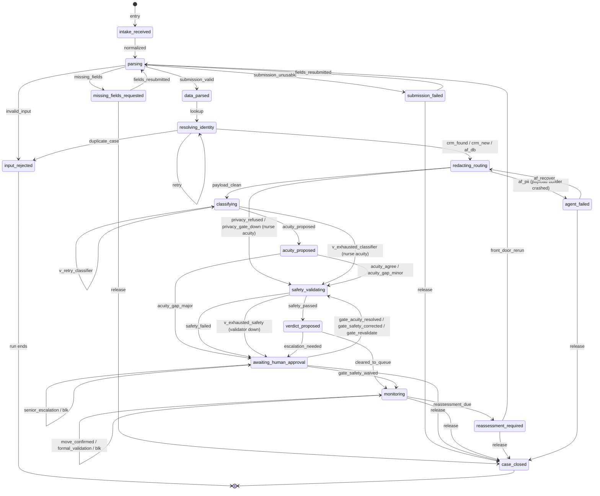

# Triage Guard Diagrams

_This is a companion to `triage-guard-spec.md`. It shows two views of the same system: the architecture diagram and the central control-plane state machine, as Mermaid diagrams._

---

## Architecture diagram

_The diagram groups, agents, and numbered arrows below match [`../assets/triage-guard-system.png`](../assets/triage-guard-system.png). **Solid** arrows show Orchestrator to agent actions. **Dashed** arrows show agent to Orchestrator proposals. The **thick** arrow is the only time the Orchestrator writes to State. The numbers match the arrow numbers in the Transitions table of the spec._

## State-machine diagram

The central control-plane state machine, drawn from the states in the specification's Transitions table and the edges the running graph wires. Guards, actions and world effects stay in that table. Each arrow is labelled with the transition name the audit trail records for it.

How to read it:

- A self-loop is a step that ran again without moving the case: a retry after malformed output, a refused action (`blk`), a hand-off to a shift lead (`senior_escalation`), or a board move inside the queue (`move_confirmed`, `formal_validation`).
- "nurse acuity" marks the degrade path: the model is skipped or unusable and the case continues on the nurse's own acuity, with the acuity gate off.
- `release` closes the card. A charge nurse can release a patient from any state where the case is paused for a person, which is every state with a `release` arrow.

