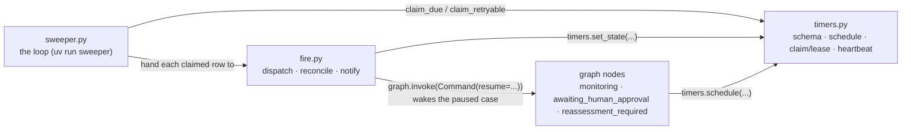
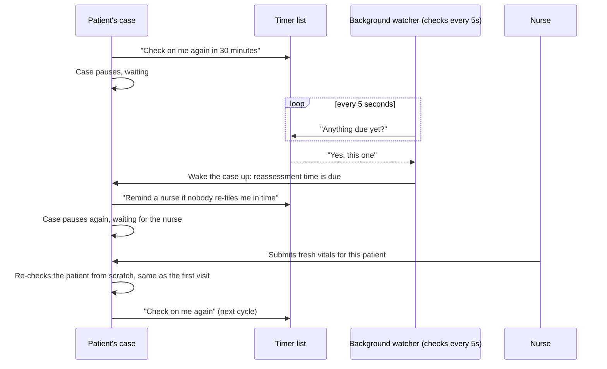
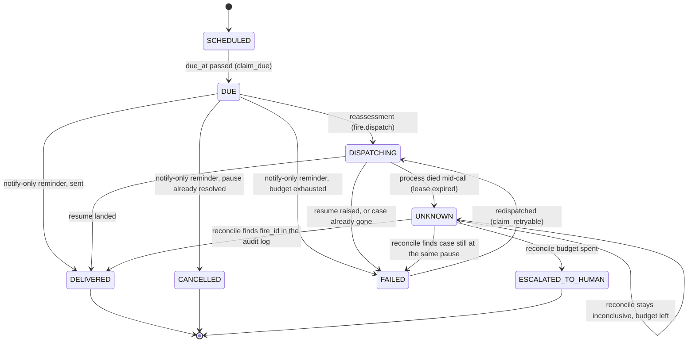

# The waiting-room monitor

How `app/monitor/` works, plus the graph nodes it talks to
(`app/graph/nodes/terminal.py`, `gate.py`, `reassessment.py`).

## The problem

A triaged patient waiting in the queue must be looked at again after a while
(a "reassessment"). Nobody watches a clock per patient, so a background
process does: the **monitor**.

## The three files

```
app/monitor/timers.py    the table + reads/writes; claims rows without two processes taking the same one
app/monitor/fire.py      "a timer is due - now what?" logic
app/monitor/sweeper.py   the loop: every 5s ask timers.py what's due, hand it to fire.py (`uv run sweeper`)
```

Tests mirror the split in `tests/monitor/`.



## Key idea: the case is paused, not finished

A queued case saves its exact state and **pauses**. It wakes when the sweeper
says "your timer went off" or a nurse says "this patient got worse", and
continues from where it stopped with that new input.

## One reassessment, start to finish



1. Case clears to the queue. `monitoring` calls `timers.schedule(...)`: "check
   again in N minutes", N by acuity (`REASSESSMENT_INTERVAL_MINUTES` in
   `app/budgets.py`):

   | ESI acuity       | recheck interval |
   | ---------------- | ---------------- |
   | 1 (most urgent)  | 10 min           |
   | 2                | 15 min           |
   | 3                | 30 min           |
   | 4                | 60 min           |
   | 5 (least urgent) | 120 min          |

2. `awaiting_reassessment` calls `interrupt()`. The run freezes.
3. `uv run sweeper` polls every 5s. When the row is due, it claims it (marks it
   taken, so a second sweeper skips it) and hands it to `fire.dispatch()`.
4. `fire.dispatch()` calls `graph.invoke(Command(resume={"event":
   "REASSESSMENT_TIMEOUT", ...}), config)` - LangGraph's "wake this paused
   run with this answer". The frozen node continues.
5. `reassessment_required` schedules a reminder timer and pauses again at
   `awaiting_reassessment_submission`. `intake-channel`'s `POST /reassess/{case_id}`
   (a form on the board's case panel) answers it with fresh vitals; routing
   fields (`case_id`, `free_text`, ...) carry over unchanged.
6. The whole pipeline re-runs on the fresh data - classification, gate,
   safety - like a new case, because a changed acuity needs the same checks.
7. Still fine? Back to the queue with a new timer for the next cycle.

## Fire states

"Fire" = a timer going off, like an alarm. `fire.py` handles what happens
next. Every timer has a `fire_state`; these are all of them:

| Status (`fire_state`) | Meaning                                                                    |
| --------------------- | -------------------------------------------------------------------------- |
| `SCHEDULED`           | Waiting for its time.                                                      |
| `DUE`                 | Time came; sweeper picked it up.                                           |
| `DISPATCHING`         | Delivering the event right now.                                            |
| `DELIVERED`           | Worked. Done.                                                              |
| `FAILED`              | Clear "no" - case closed or missing. Safe to retry or give up.             |
| `UNKNOWN`             | Not sure it worked (process died mid-attempt).                             |
| `ESCALATED_TO_HUMAN`  | Checked enough times, still unsure - page a human.                         |
| `CANCELLED`           | Reminder no longer matters (notify-only reminders, see below).             |

No stored "reconciling" state: `fire.reconcile()` takes an `UNKNOWN` row and
resolves it in one call to `DELIVERED`, `FAILED`, `UNKNOWN` again, or
`ESCALATED_TO_HUMAN`.



The rule that matters: `UNKNOWN` **never jumps straight back to `DISPATCHING`**.
A blind retry could deliver twice. `reconcile()` first checks the case's audit
trail for this exact fire; only a clear "no" leads to a retry.

That is what `fire_id` is for: a fingerprint of `(case_id, kind, cycle, due_at)`,
so reconciliation asks "did _this_ fire land?" not "did _a_ reassessment happen?"

## Notify-only reminders

A second kind of timer. At the human-approval gate, two `gate_reminder` timers
are scheduled at once: ping the assigned nurse after 10 min, widen to any
charge nurse after 20. The re-filing pause schedules one
`reassessment_reminder`, straight to any charge nurse.

They **don't change the case** - just send a notification - so they skip
`DISPATCHING`/`UNKNOWN`/reconcile. `fire.notify()` checks the case is still at
the pause the reminder is about (`_REMINDER_PAUSES`): yes → send once per
reason, within the recipient's budget; no (or unknown kind) → `CANCELLED`.

## The heartbeat: watching the watcher

A crashed sweeper fails silently: timers just stop firing. So every tick the
sweeper writes a heartbeat row, and the board (`/api/heartbeat`) checks its
age from the outside. Too old → "monitor degraded" banner. A dead process
can't self-report, so the check must live elsewhere.

## Two bugs we hit

**The cycle number.** Timer id is `case_id:kind:cycle`. With `cycle` always 0,
the next reassessment reused the same id and due time forever. Fix:
`reassessment_cycle` lives on the case and increments each fire.

**Matching on "no fingerprint".** Dedupe was `rec.get("fire_id") == fire_id`.
A nurse's deterioration report has no `fire_id`, and neither do many unrelated
audit rows, so `None == None` dropped real reports as duplicates. Fix: only
compare when there is a fingerprint (`if fire_id and ...`).

Both only show up after the cycle runs more than once - "worked in the first
test" and "works" are different claims.
